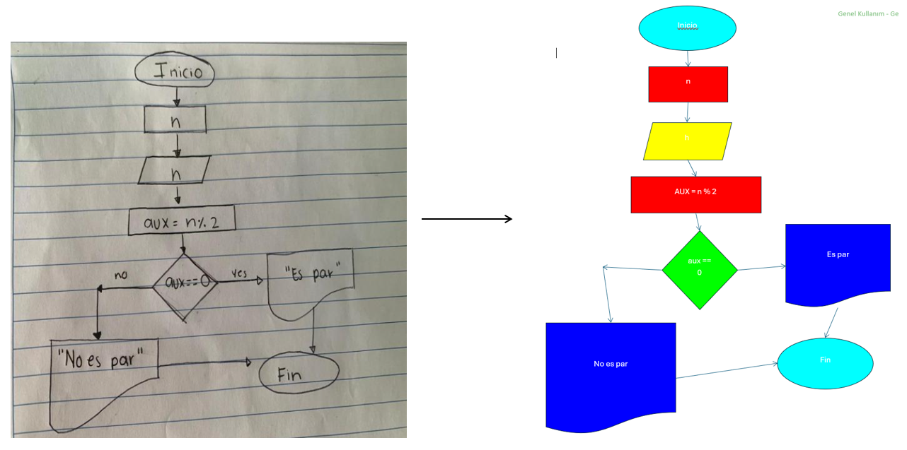
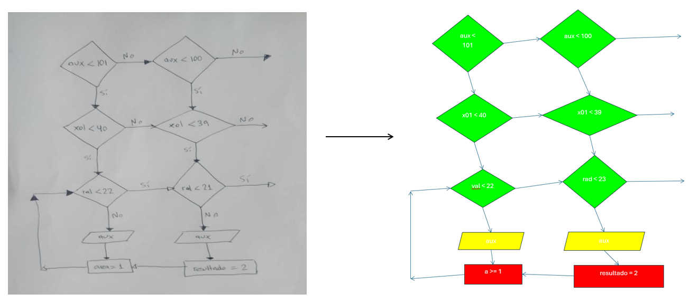
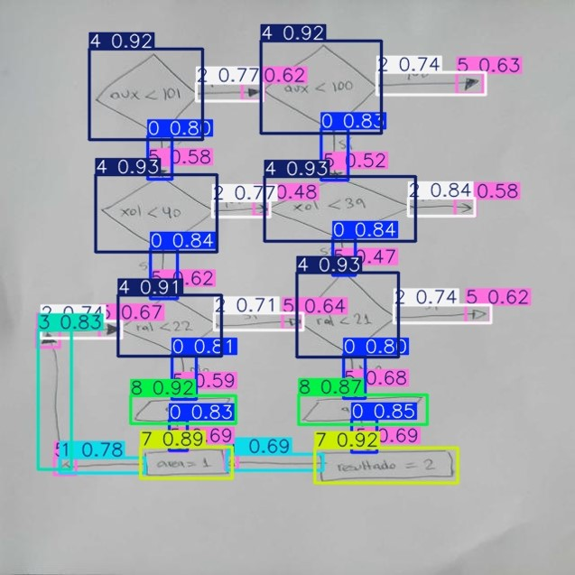

# Flowchart Processing Project

This project automates the processing of flowchart images by detecting shapes using a YOLO model, drawing them in a Word document, and extracting handwritten text via the GPT4o. It also generates a JSON representation of the flowchart and an NXN connectivity matrix.

## Features

- **Shape Detection:** Uses a YOLO model to identify various flowchart components (e.g., Process, Decision, Start/End, Output, Input).
- **Word Automation:** Draws detected shapes and arrows in a Microsoft Word document using Windows COM automation.
- **OCR via GPT:** Extracts handwritten text from each shape's image region using the GPT API.
- **Data Export:** Generates structured outputs:
  - JSON file with nodes, arrows, and OCR text.
  - NXN matrix representing the connectivity between shapes.
## Examples

## Requirements

- Python 3.8+
- [ultralytics](https://github.com/ultralytics/ultralytics)
- [pywin32](https://pypi.org/project/pywin32/)
- [opencv-python](https://pypi.org/project/opencv-python/)
- [transformers](https://huggingface.co/docs/transformers/)
- [Pillow](https://python-pillow.org/)
- [openai](https://github.com/openai/openai-python)
- Microsoft Word (Windows environment)

Dataset : https://universe.roboflow.com/utem-ggh5t/shapes-detection-in-flowcharts

## YOLOv11s Detection

